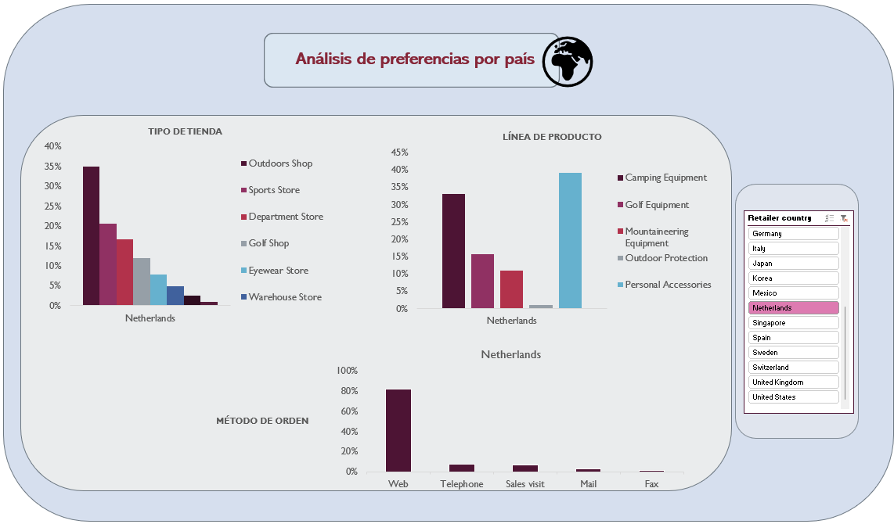

# :tent: **Análisis de ventas de artículos deportivos**

:book: **Descripción**

Este proyecto realiza un análisis exploratorio y descriptivo de las ventas de productos de diferentes líneas y categorías de una tienda de artículos deportivos al por menor. 
El análisis se centra en los ingresos derivados de las ventas y las preferencias de los distintos países.
        

:file_folder: **Estructura del Proyecto**

        ├── datos/               # Datos crudos
        ├── VentasProductos/     # Datos procesados
        ├── Dashboard/           # Gráficos y archivos de resultados
        ├── README.md            # Descripción del proyecto
     

🛠️ **Instalación y Requisitos**

Este proyecto usa Excel versión 2410 y se han utilizado las siguientes herramientas y complementos:

- Herramientas de análisis de datos

- Power Query

📊 **Resultados y Conclusiones**

- Identificamos un aumento anual en los ingresos hasta el tercer trimestre de 2014, cuando se produce una caída pronunciada, de aproximadamente el 50%.

- El país que más ingresos genera es Estados Unidos, con una diferencia de más de 100 millones sobre Japón, el segundo en ingresos.

- En general, las tiendas de tipo Outdoor Shop son las que más ingresos generan, con bastante diferencia sobre los demás.

- En cuanto a la línea de producto con más ingresos es la de Personal Accessories, lo que corresponde con los productos con más unidades vendidas.

- De los productos más rentables ninguno pertenece a la línea más vendida. 

- Al analizar las preferencias por país se puede ver que las tiendas tipo Outdoor Shop no son las favoritas en todos los países, como es el caso de Korea o Dinamarca, por ejemplo. Además, hay países que no tienen todos los tipos de tiendas. 

- Ocurre lo mismo con la línea de producto más vendida, aunque a nivel general es Personal Accessories, en países como Korea o México se vende más Camping Equipment.

- Por otro lado, se puede ver que el método de orden preferido es la Web y que prácticamente no se hacen pedidos por los métodos Mail y Special. 

🔄 **Próximos Pasos**

- Analizar los costes de los productos y su influencia en la caída de ingresos de 2014.
- Analizar las ventas de cada producto por país para poder enfocar campañas de marketing de los productos menos vendidos.

🤝 **Contribuciones**

Las contribuciones son bienvenidas. Si deseas mejorar el proyecto, por favor abre un pull request o una issue.

✒️ **Autores y Agradecimientos**

**Marta María Llordén Alonso** - [@MartaM1206](https://github.com/MartaM1206)
     

