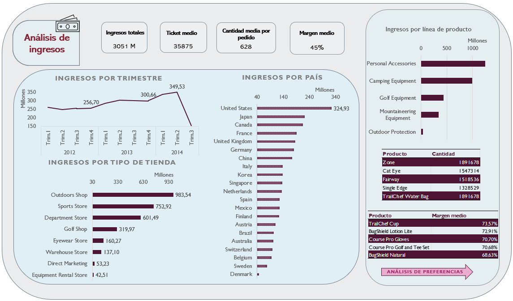

# :tent: <span style="color:MediumVioletRed">**Análisis de ventas de artículos deportivos**</span>

:book: <span style="color:PaleVioletRed">**Descripción**</span>

    Este proyecto realiza un análisis exploratorio y descriptivo de las ventas de productos de diferentes líneas y categorías de una tienda de artículos deportivos al por menor.
        

:file_folder: <span style="color:PaleVioletRed">**Estructura del Proyecto**</span>


        ├── datos/               # Datos crudos
        ├── VentasProductos/     # Datos procesados
        ├── Dashboard/           # Gráficos y archivos de resultados
        ├── README.md            # Descripción del proyecto
     

🛠️ <span style="color:PaleVioletRed">**Instalación y Requisitos**</span>

     Este proyecto usa Excel versión 2410 


📊 <span style="color:PaleVioletRed">**Resultados y Conclusiones**</span>

        - Identificamos un aumento anual en los ingresos hasta el tercer trimestre de 2014, cuando se produce una caída pronunciada, de aproximadamente el 50%.
        - El país que más ingresos genera es Estados Unidos, con una diferencia de más de 100 millones sobre Japón, el segundo en ingresos.
        - Aunque en total, las tiendas de tipo Outdoor Shop son las que más ingresos generan, con bastante diferencia sobre los demás, no se da en todos los países, como es el caso de Korea o Dinamarca, por ejemplo. Además, hay países que no tienen todos los tipos de tiendas.
        - La amplia mayoría de órdenes se producen vía Web.
        - En cuanto a la línea de producto con más ingresos es la de Personal Accessories, lo que corresponde con los productos con más unidades vendidas.
        - De los productos más rentables ninguno pertenece a la línea más vendida. 
       


🔄 <span style="color:Yellow">**Próximos Pasos**</span>

        - Analizar la posibilidad de dejar de vender en los países que generan menos ingresos.
        - Trasladar todo el sistema de órdenes a los mayoritarios para reducir costes.
        - Explorar el impacto de factores externos como campañas de marketing y eventos en las ventas.
        ```

🤝 <span style="color:PaleVioletRed">**Contribuciones**</span>

     Las contribuciones son bienvenidas. Si deseas mejorar el proyecto, por favor abre un pull request o una issue.


✒️ <span style="color:PaleVioletRed">**Autores y Agradecimientos**</span>

     **Marta María Llordén Alonso** - [@MartaM1206](https://github.com/MartaM1206)
     

